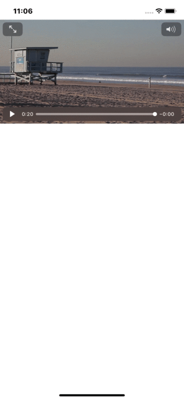

# SwipeShrink

Swipe a view down to shrink it into a mini player docked in the bottom-trailing
corner — like the YouTube video player. Tap the mini player to restore it.

Ships as two products over one shared, unit-tested transition model:

| Product | Use it from |
| --- | --- |
| `SwipeShrink` | UIKit — drives an existing `UIView` |
| `SwipeShrinkUI` | SwiftUI — the `SwipeShrinkView` container |

Both are driven by the same `SwipeShrinkGeometry`, so they cannot drift apart.



## Requirements

- iOS 13.0+ / tvOS 13.0+
- Swift 6.0+ (Xcode 16+); builds in Swift 6 language mode with complete strict
  concurrency checking
- No third-party dependencies

## Installation

### Swift Package Manager

Add the package in Xcode via **File → Add Packages…**, or declare it in your
`Package.swift`:

```swift
dependencies: [
    .package(url: "https://github.com/devmucahideyvaz/SwipeShrink.git", from: "1.0.0")
]
```

### CocoaPods

```ruby
pod 'SwipeShrink'            # UIKit
pod 'SwipeShrink/SwiftUI'    # SwiftUI
```

### Manually

Copy the contents of `Sources/SwipeShrink/` into your project, plus
`Sources/SwipeShrinkUI/` if you want the SwiftUI view.

## SwiftUI usage

`SwipeShrinkView` fills the space it is offered and positions its content
inside it, so give it the area the content should travel across — usually the
top layer of a `ZStack`:

```swift
import SwipeShrink
import SwipeShrinkUI
import SwiftUI

struct ContentView: View {
    @State private var playerState: SwipeShrinkState = .expanded

    var body: some View {
        ZStack {
            FeedList()

            SwipeShrinkView(state: $playerState) { proxy in
                VideoPlayer(player: player)
                    .overlay(proxy.isCollapsed ? CloseButton() : nil,
                             alignment: .topTrailing)
            }
        }
    }
}
```

`state` is a binding, so the transition can also be driven programmatically:

```swift
withAnimation { playerState = .collapsed }
```

The closure is handed a `SwipeShrinkProxy` describing the transition as it
runs:

| Member | Description |
| --- | --- |
| `state` | The resting state the view is in, or animating towards |
| `progress` | `0` expanded … `1` collapsed, interpolated during a drag |
| `isExpanded` / `isCollapsed` | Convenience checks |

Where UIKit reads a laid-out frame, SwiftUI has none until layout runs, so the
expanded frame is described declaratively with `SwipeShrinkExpandedFrame`:

```swift
SwipeShrinkView(
    state: $playerState,
    expandedFrame: SwipeShrinkExpandedFrame(widthRatio: 1,
                                            aspectRatio: 9 / 16,
                                            topInset: 44)
) { _ in
    VideoPlayer(player: player)
}
```

Rotation and split-view resizes need no handling: the `GeometryReader` re-reads
the available space and the geometry is rebuilt on every layout.

## UIKit usage

```swift
import AVFoundation
import AVKit
import SwipeShrink
import UIKit

final class ViewController: UIViewController {
    @IBOutlet weak var shrinkedView: UIView!

    private let shrink = SwipeShrink()
    private let player = AVPlayer()
    private let playerViewController = AVPlayerViewController()

    private var hasPreparedShrink = false

    override func viewDidLoad() {
        super.viewDidLoad()

        playerViewController.player = player
        addChild(playerViewController)
        playerViewController.view.frame = shrinkedView.bounds
        playerViewController.view.autoresizingMask = [.flexibleWidth, .flexibleHeight]
        shrinkedView.addSubview(playerViewController.view)
        playerViewController.didMove(toParent: self)

        if let url = Bundle.main.url(forResource: "bayw-HD", withExtension: "mp4") {
            player.replaceCurrentItem(with: AVPlayerItem(url: url))
        }
    }

    override func viewDidAppear(_ animated: Bool) {
        super.viewDidAppear(animated)
        guard !hasPreparedShrink else { return }
        hasPreparedShrink = true
        shrink.prepare(view: shrinkedView, in: view)
    }

    override func viewWillTransition(to size: CGSize,
                                     with coordinator: UIViewControllerTransitionCoordinator) {
        super.viewWillTransition(to: size, with: coordinator)
        coordinator.animate(alongsideTransition: { [weak self] _ in
            guard let self = self else { return }
            // Pass an explicit frame when the managed view is positioned by a
            // fixed frame; omit it when its autoresizing mask keeps it correct.
            self.shrink.updateLayout(expandedFrame: CGRect(x: 0,
                                                           y: self.view.safeAreaInsets.top,
                                                           width: size.width,
                                                           height: size.width * 9 / 16))
        })
    }
}
```

`prepare(view:in:)` must be called once the managed view has its final expanded
frame — `viewDidAppear` is a good place. Calling it again is safe: it detaches
the gestures it installed previously rather than stacking a second set.

## Configuration

```swift
var configuration = SwipeShrinkConfiguration()
configuration.collapsedWidthRatio = 0.45   // mini player width, as a fraction of the parent
configuration.horizontalInset = 12         // margin from the trailing edge
configuration.bottomInset = 8              // margin from the bottom edge
configuration.animationDuration = 0.3
configuration.flickVelocityThreshold = 600 // pt/s above which a flick wins over position

let shrink = SwipeShrink(configuration: configuration)
```

Assigning `shrink.configuration` after `prepare` re-derives the layout
immediately.

## UIKit API

| Member | Description |
| --- | --- |
| `prepare(view:in:)` | Attaches the gestures and computes the layout. Idempotent. |
| `updateLayout(expandedFrame:)` | Recomputes the layout after the parent resizes. Pass a frame to override, or `nil` to derive one. |
| `setState(_:animated:completion:)` | Moves to `.expanded` or `.collapsed`. |
| `toggle(animated:)` | Switches between the two states. |
| `state` | The current resting state (read-only). |
| `onStateChange` | Called when the resting state changes. |
| `geometry` | The `SwipeShrinkGeometry` currently driving the transition. |
| `invalidate()` | Detaches the gestures and forgets the layout. |

## Concurrency

The package builds in Swift 6 language mode, so complete strict concurrency
checking is on.

- `SwipeShrink` drives UIKit views and is therefore `@MainActor`-isolated. Call
  every member from the main actor — which you get for free inside a
  `UIViewController`, since UIKit is main-actor isolated too. Being
  global-actor isolated also makes it implicitly `Sendable`.
- `onStateChange` is invoked on the main actor.
- `SwipeShrinkGeometry`, `SwipeShrinkConfiguration`, `SwipeShrinkState` and
  `SwipeShrinkExpandedFrame` are `Sendable` value types with no isolation, so
  the transition maths can be used from any isolation domain — including off the
  main actor, and in tests that never touch UIKit.
- `SwipeShrinkView` and `SwipeShrinkProxy` follow SwiftUI's own model:
  the view is `@MainActor`-isolated, the proxy is a `Sendable` value.

Calling a member from a non-isolated context needs an ordinary hop:

```swift
await MainActor.run {
    shrink.setState(.collapsed)
}
```

## Behaviour notes

- **Aspect ratio** is derived from the managed view's expanded frame, so the
  view never jumps when the pan begins, and it is preserved for the whole
  transition. Non-16:9 views are supported.
- **The collapsed resting position** is anchored to the parent's
  bottom-trailing corner using the collapsed size, so it does not depend on how
  tall the expanded view is.
- **Flicks** settle in the direction of travel; slower drags settle to whichever
  resting position is nearer.
- **Cancelled gestures** (an incoming call, a system alert) settle the view
  rather than leaving it mid-drag.
- **While expanded, taps pass through** to your content, so an
  `AVPlayerViewController`'s transport controls keep working. The tap gesture
  only activates while collapsed.

These hold for both products — they are properties of the shared
`SwipeShrinkGeometry`, not of either renderer.

## Layout requirements (UIKit only)

`SwipeShrink` positions the managed view by writing to its `bounds` and `center`.
The view must therefore be laid out by its autoresizing mask, **not** by Auto
Layout constraints that pin its position or size — a layout pass would otherwise
undo the transition. Subviews of the managed view may use Auto Layout freely.

`SwipeShrinkView` has no such restriction — it lays its content out itself.

## Example

Open `SwipeShrinkExample/SwipeShrinkExample.xcodeproj` and run — it demonstrates
the UIKit API with an `AVPlayerViewController`. The SwiftUI view ships with an
Xcode preview in `Sources/SwipeShrinkUI/SwipeShrinkView.swift`.

## Tests

```sh
swift test
```

The transition maths lives in `SwipeShrinkGeometry`, which has no UIKit
dependency and is covered by unit tests.

## License

MIT — see [LICENSE](LICENSE).
